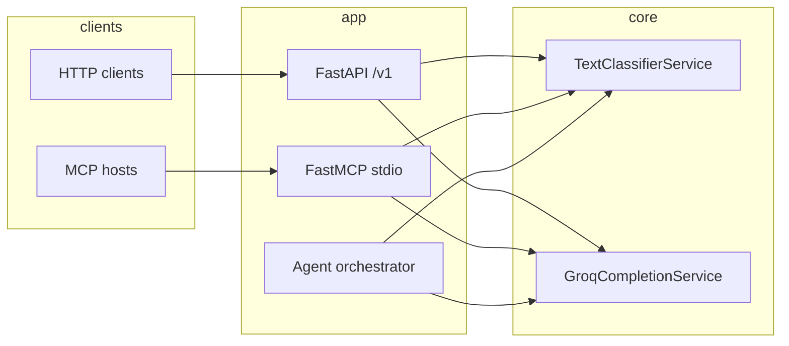

# AI vs Human Text — FastAPI, FastMCP, and agentic orchestration

Production-oriented evolution of an Indiana University **ENGR-E516 (ECC)** coursework project: *Cloud-based AI vs Human Text Detection* (Naive Bayes + TF-IDF over a bag-of-words pipeline). This repository replaces a toy Flask + Jetstream2 deployment with a **layered architecture** suitable for portfolios and interviews: REST API, **Model Context Protocol (FastMCP)** tools, optional **Groq** LLM explanations, and a **tool-calling agent** with Pydantic validation repair.

> **Dataset note:** The default artifact is trained on a small **bundled stylistic demo corpus** so CI and `docker build` work without Kaggle credentials. For metrics comparable to the original ECC report (~95% accuracy on held-out data), train on the [Kaggle AI vs Human Text](https://www.kaggle.com/datasets/shanegerami/ai-vs-human-text) dataset using the same `CountVectorizer` → `TfidfTransformer` → `MultinomialNB` pipeline (see `src/ai_vs_human_text/ml/train.py`).

## Architecture



- **`TextClassifierService`**: thread-safe lazy load of the sklearn `Pipeline`; input length guards; structured errors (`ModelNotLoadedError`, `PredictionError`, etc.).
- **`GroqCompletionService`**: optional chat completions with **primary → fallback** model rotation on rate limits (429).
- **Agent (`run_agent_turn`)**: Groq tool calls for `classify_text` and `model_info` with **`repair_and_validate`** on tool arguments (e.g. stringified numbers) before Pydantic validation.
- **HTTP resilience helper** (`services/http_client.py`): async retries with exponential backoff for outbound calls (pattern aligned with resilient tool handlers).

## Quick start

```bash
cd ai_vs_human_text
python -m venv .venv
.venv\Scripts\activate   # Windows
pip install -e ".[dev]"
python scripts/train_model.py
ai-vs-human-api
```

- API: `http://127.0.0.1:8000/docs`
- Health: `GET /v1/health`
- Classify: `POST /v1/classify` with `{"text": "..."}`
- Model metadata: `GET /v1/model`
- Optional explanation: `POST /v1/explain` (requires `GROQ_API_KEY`)
- Agent (tool calling): `POST /v1/agent` with `{"message": "Classify: ..."}` (requires `GROQ_API_KEY`)

### MCP server (stdio)

Configure your MCP client to run:

```bash
ai-vs-human-mcp
```

Tools: `classify_text`, `model_info`, `explain_classification` (Groq optional).

Ensure the working directory is the repo root (or set `AI_VS_HUMAN_MODEL_PATH` / `AI_VS_HUMAN_METRICS_PATH` to absolute paths) so the model artifact resolves correctly.

### Environment

Copy `.env.example` to `.env` and set variables as needed. Groq keys are read as `GROQ_API_KEY` (see `.env.example`).

### Docker

```bash
docker compose up --build
```

The image runs `train_model.py` at build time and starts `ai-vs-human-api` on port 8000.

## Development

```bash
pytest
ruff check src tests
```

## Project layout

| Path | Role |
|------|------|
| `src/ai_vs_human_text/api/` | FastAPI app, routes, lifespan, exception mapping |
| `src/ai_vs_human_text/mcp_server.py` | FastMCP tool definitions |
| `src/ai_vs_human_text/agent/` | Tool schemas, argument repair, Groq agent loop |
| `src/ai_vs_human_text/ml/` | Classifier service + training utilities |
| `scripts/train_model.py` | CLI to write `artifacts/model.joblib` |
| `tests/` | API, classifier, and tool-repair tests |

## ECC provenance

Original coursework team: **Nitish Pawale**, **Vedant Satpute** (IU Bloomington, April 2024). Stack at the time: Nginx, Gunicorn, Flask, Jetstream2, scikit-learn pipeline as described in the final report. This repository is an **independent open implementation** with a modern agent/MCP surface and does not imply affiliation with the World Bank or any confidential client work.

## License

MIT
